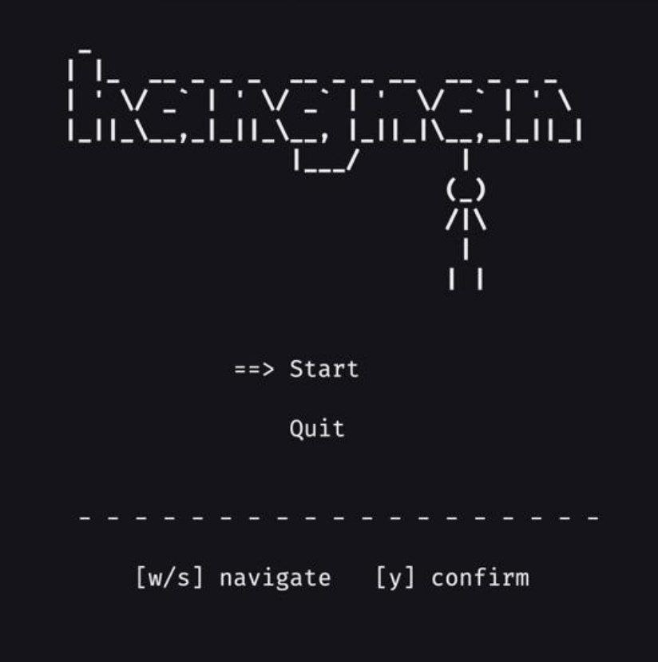
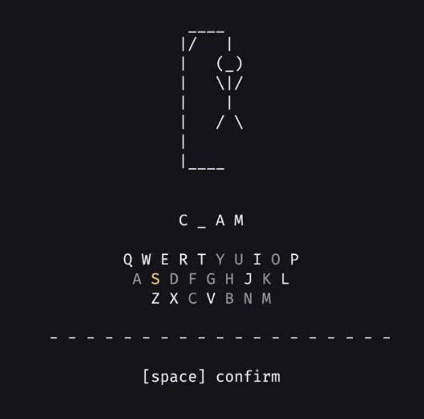

# Hangman CLI

A classic Hangman game running in the terminal, written in C.

## Features
- Random word selection from a pool of 64 words
- Full ASCII hangman animation with 12 stages
- QWERTY keyboard layout for letter selection
- Win/loss detection with round reset
- Menu system to start a new game or quit

## How to play
1. A random word is chosen — dashes show the number of letters
2. Navigate the keyboard with arrow keys, select a letter
3. Press **Space** to confirm your choice
4. Guess the word before you run out of attempts




## Build & Run
```bash
cd src
gcc *.c -o hangman && ./hangman
```

## Project Structure
```
src/
├── main.c
├── render_game.c / .h
├── render_menu.c / .h
├── handle_game_input.c / .h
├── handle_menu_input.c / .h
├── check_win_loss.c / .h
├── check_lifes.c / .h
├── match_check.c / .h
├── utils.c / .h
└── defs.h
```
